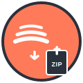

# SpotZip 🎵📦

**SpotZip** es una aplicación web moderna para descargar canciones y playlists de Spotify con una interfaz intuitiva y amigable.



## ✨ Características

- 🎵 **Descarga canciones individuales** de Spotify
- 📋 **Descarga playlists completas** empaquetadas en ZIP
- 🎛️ **Múltiples formatos de audio**: MP3, M4A, FLAC, OGG, OPUS
- ⚡ **Diferentes calidades**: desde 96kbps hasta 320kbps
- 🌐 **Interfaz web moderna** y responsiva
- 📊 **Progreso en tiempo real** de las descargas
- ✅ **Validación automática** de URLs de Spotify

## 🚀 Instalación

### Requisitos previos
- Python 3.8 o superior
- pip (gestor de paquetes de Python)

### Pasos de instalación

1. **Clona el repositorio:**
```bash
git clone https://github.com/FdevMX/SpotZip.git
cd SpotZip
```

2. **Crea y activa un entorno virtual:**
```bash
python -m venv .venv
# En Windows:
.venv\Scripts\activate
# En macOS/Linux:
source .venv/bin/activate
```

3. **Instala las dependencias:**
```bash
pip install -r requirements.txt
```

4. **Ejecuta la aplicación:**
```bash
python app.py
```

5. **Abre tu navegador y ve a:**
```
http://localhost:5000
```

## 🎯 Uso

1. **Copia la URL** de una canción, álbum o playlist de Spotify
2. **Pégala en el campo URL** de la aplicación
3. **Selecciona el formato** y calidad deseados
4. **Haz clic en "Descargar"** para canciones individuales
5. **O haz clic en "Descargar como ZIP"** para playlists completas
6. **Espera a que se complete** la descarga y disfruta tu música

## 📁 Estructura del Proyecto

```
SpotZip/
├── app.py              # Aplicación Flask principal
├── downloader.py       # Lógica de descarga con spotdl
├── requirements.txt    # Dependencias de Python
├── static/
│   ├── css/           # Estilos CSS
│   ├── img/           # Imágenes y logos
│   └── js/            # JavaScript del frontend
├── templates/
│   └── index.html     # Plantilla HTML principal
├── downloads/         # Descargas temporales (no incluido en Git)
└── zips/             # Archivos ZIP generados (no incluido en Git)
```

## 🛠️ Tecnologías Utilizadas

- **Backend**: Flask (Python)
- **Frontend**: HTML5, CSS3, JavaScript
- **Diseño**: CSS Grid, Flexbox

## ⚖️ Consideraciones Legales

Esta aplicación está destinada **únicamente para uso personal y educativo**. 

⚠️ **Importante**: 
- Respeta los derechos de autor y las condiciones de servicio de Spotify
- No distribuyas contenido protegido por derechos de autor

## 🤝 Contribución

Las contribuciones son bienvenidas. Para contribuir:

1. Fork el proyecto
2. Crea una rama para tu característica (`git checkout -b feature/nueva-caracteristica`)
3. Commit tus cambios (`git commit -m 'Añadir nueva característica'`)
4. Push a la rama (`git push origin feature/nueva-caracteristica`)
5. Abre un Pull Request

## 📝 Licencia

Este proyecto está bajo la Licencia GPL-3.0. Consulta el archivo `LICENSE` para más detalles.

## 👨‍💻 Autor

**FdevMX** - [GitHub](https://github.com/FdevMX)

---

<div align="center">
  <strong>¿Te gusta SpotZip? ¡Dale una ⭐ al proyecto!</strong>
</div>
